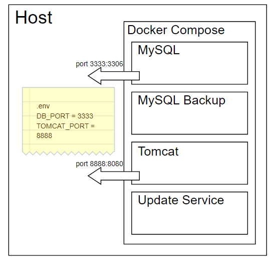

# Aquality Tracking
Here is you can find  docker compose that will start your **Aquality Tracking**.
**Before we start, make sure you have [docker](https://www.docker.com) installed.**

You can configure MySQL DB password, port as well as tomcat port using `/.env` file.

After you configure everything just click **startup.sh** (or **startup.bat**). 
The latest version of Aquality Tracking will be started.

If you need to update Aquality Tracking to the latest version just click **update.sh** (or **update.bat**).

If you need to stop Aquality Tracking just click **stop.sh** (or **stop.bat**).

## System structure

### Services:
1. MySQL
    The MySQL service will be started first. You can to connect to it using port and password you specified in `/.env` file.
2. MySQL Backup
    The MySQL Backup service will be started after MySQL. It used for backuping your data every day at **11:30 PM**. The backup files can be found in the `/db_backup` folder.
3. Tomcat
    The Tomcat will serve the Aquality Tracker application and will be started after The MySQL Backup service. You can connect to it using port you specified in `/.env` file.
4. Update Service
    The Update Service will deploy latest version of the Aquality Tracking application.
	1. Grab latest version of Aquality Tracking application (from master branch)
  	2. Build application and run DB migration script
  	3. Copy Artifacts to `/apps` folder
  	4. Stop the Update service

The **update.sh** (or **update.bat**) stopping all services, re-build the Update Container and than up all services again. 

## System Requirements for comfortable usage
1. OS: any with Docker support. [Windows](https://docs.docker.com/docker-for-windows/install/#what-to-know-before-you-install) |  [Mac](https://docs.docker.com/docker-for-mac/install/#what-to-know-before-you-install) | [Linux](https://docs.docker.com/install/)
2. CPU: 2 CPU 1Ghz
3. RAM: 2048 MB
4. Hard Disk: 10 GB

### Documentation
For more information, please refer to the documentation:
- [In English](https://github.com/aquality-automation/aquality-tracking/wiki)

### License
Library's source code is made available under the [Apache 2.0 license](LICENSE).